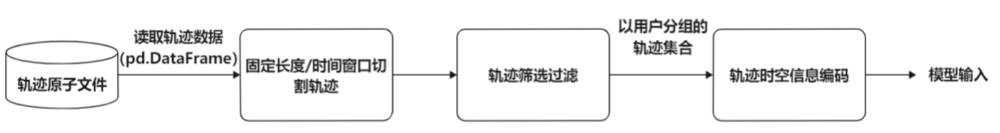

## 数据说明

#### 轨迹数据集

目前课程组提供 Gowalla 和 Foursquare 数据集，以供同学们训练和测试自己复现的模型。

轨迹数据集由以下四类原子文件组成：

* `.dyna` 文件：用于存储用户轨迹的 Check-In 记录。
* `.geo` 文件：用于存储 POI 的属性信息（经纬度坐标）。
* `.usr` 文件：用于存储用户的属性信息（如 Foursquare 包含用户性别）。
* `.rel` 文件：只有 Gowalla 有，存储的是用户之间的朋友关系网络。

关于数据集存储文件详细格式说明，同学们可以进一步查看[Atomic Files 文档](https://bigscity-trafficdl-docs.readthedocs.io/en/latest/user_guide/data/atomic_files.html)。

#### 轨迹数据预处理流程



轨迹数据预处理主要分为三个步骤：

* 轨迹切割：根据 `window_type` 与 `window_size` 将用户 Check-In 记录序列按照时间窗格或者长度窗格进行切割。
* 轨迹筛选过滤：根据 `min_session` 与 `min_session_len` 将切割过后长度过短的轨迹和拥有轨迹数目过少的用户删除，以免影响模型的性能。
* 轨迹时空信息编码：将 Check-In 记录中的时空信息编码为模型可以处理的张量。

在目前的框架设计中，前两个步骤由 `TrajectoryDataset` 完成，同学们只需要调整对应的参数设定切割与筛选标准。而最后一步是由 `TrajectoryEncoder` 完成的，由 `TrajectoryDataset` 调用 `TrajectoryEncoder` 并每次将一个用户的所有轨迹投入编码器中进行编码。

不过框架已经预先编写好了一个轨迹时空编码模块 `StandardTrajectoryEncoder`，因此若目前 `batch` 和 `data_feature` 提供的数据**已经足够支持你的模型训练预测**，则**你无需关注这一部分**。

若**不足**，则需要同学们继承 `AbstractTrajectoryEncoder` 抽象类编写符合自己模型数据编码方法的编码器，并在修改 `trafficdl/config/task_config.json` 中 `TemplateTLP` 对应的 `traj_encoder` 为自行编写的编码器类名，以替换 `StandardTrajectoryEncoder`。

#### 目前提供的模型输入

* `data_feature` 含有以下键：（可以用于初始化模型 Embedding 层）

  * loc_size：数据集中 POI 点的数目。
  * tim_size：时间窗口的大小，单位是小时。
  * uid_size：数据集中用户的数目。
  * loc_pad：补全轨迹所用的 POI 填充值。
  * tim_pad：补全轨迹所用的时间编码。
  * poi_profile：POI 的 Profile 信息。类型为 pandas.Dataframe，是直接将原始数据中保存 POI 信息的文件（`.geo`）读出的结果，示例如下：

  ```
  geo_id,type,coordinates,venue_category_name
  0,Point,"[139.73674,35.658338]",Neighborhood
  1,Point,"[139.70713999999998,35.697790999999995]",Coffee Shop
  2,Point,"[139.691119,35.690712]",Hotel
  3,Point,"[139.726074,35.711962]",Hotel
  4,Point,"[139.758711,35.672271]",Hotel
  ```

* `batch` 含有以下键：

  * history_loc：历史轨迹位置信息
  * history_tim：历史轨迹时间信息
  * current_loc：当前轨迹位置信息
  * current_tim：当前轨迹时间信息
  * uid：用户 id
  * target：要预测的下一跳位置信息
  * target_tim：要预测的下一跳时间信息

具体各值对应的数据格式，各组可以参见 test_model.py 脚本，实际在命令行运行进行观察验证。此外对于数据处理部分有想要详细了解的组，可以查看 `/trafficdl/data/dataset/trajectory_dataset.py` 和框架[文档](https://bigscity-trafficdl-docs.readthedocs.io/en/latest/index.html)，以及咨询助教。对于部分困难模型，可能需要组自行参考开源代码的数据处理方式，实现一个 dataset 类。

关于补全，是出于提升模型训练效率、实现批量数据投入（即 batch 输入），才需要将不定长的轨迹数据补齐到一样的长度，做成 tensor 投入模型中。补齐操作是在 `trafficdl.data.batch` 类的 `padding` 方法实现的，此外还提供 `get_origin_len` 方法能够获取到补全之前各轨迹的长度。 

#### 编码模块接口介绍（仅针对框架提供的输入数据不足以满足所选模型运行的同学）

抽象编码模块类：

```python
class AbstractTrajectoryEncoder(object):
    """Trajectory Encoder

    Trajectory Encoder is used to encode the spatiotemporal information in trajectory.
    We abstract the encoding operation from the Dataset Module to facilitate developers
    to achive more flexible and diverse trajectory representation extraction. It is worth
    noting that the representation extraction involved here is not learnable and fixed.
    Any learnable representation extraction, e.g. embedding, should be emplemented in
    Model Module.

    Attributes:
        config (trafficdl.ConfigParser): The configuration of the encoder.
        pad_item (dict): The key is a feature's name and the value should be corresponding
            padding value. If a feature dose not need to be padded, don't insert it into
            this dict. In other word, trafficdl.dataset.Batch will pad all features in pad_item.keys().
        feature_max_len (dict): The key is a feature's name and the value should be corresponding
            max length. When trafficdl.dataset.Batch pads features, it will intercept the excessively
            long sequence feature according to this attribute.
        feature_dict (dict): The key is a feature's name and the value should be the data type of
            the corresponding feature. When trafficdl.dataset.Batch converts the encoded trajectory tuple
            to tensor, It will refer to this attribute to know the feature name and data type corresponding
            to each element in the tuple.
        data_feature (dict): The data_feature contains the statistics features of the encoded dataset, which is
            used to init the model. For example, if the model use torch.nn.Embedding to embed location id and time id,
            the data_feature should contain loc_size and time_size to tell model how to init the embedding layer.
    """

    def __init__(self, config):
        """Init Encoder with its config

        Args:
            config (trafficdl.ConfigParser): Dict-like Object. Can access any config by config[key].
        """
        self.config = config
        self.pad_item = {}
        self.feature_max_len = {}
        self.feature_dict = {}
        self.data_feature = {}
        self.cache_file_name = ''

    def encode(self, uid, trajectories):
        """Encode trajectories of user uid.

        Args:
            uid (int): The uid of user. If there is no need to encode uid, just keep it.
            trajectories (list of trajectory): The trajectories of user. Each trajectory is
            a sequence of spatiotemporal point. The spatiotemporal point is represented by
            a tuple. Thus, a trajectory is represented by a list of tuples. For example:
                trajectory1 = [
                    (location ID, timestamp, timezone_offset_in_minutes),
                    (location ID, timestamp, timezone_offset_in_minutes),
                    .....
                ]
            Every spatiotemporal tuple contains all useful information in a record of the Raw
            Data (refer to corresponding .dyna file for details). In addition, the trajectories
            are represented as:
                [
                    [ # trajectory1
                        (location ID, timestamp, timezone_offset_in_minutes),
                        (location ID, timestamp, timezone_offset_in_minutes),
                        ...
                    ],
                    trajectory2,
                    ...
                ]

        Returns:
            list: The return value of this function is the list of encoded trajectories.
            Same as the input format, each encoded trajectory should be a tuple, which contains
            all features extracted from the input trajectory. The encoded trajectory will
            subsequently be converted to a torch.tensor and then directly input to the model.
            (see more in trafficdl.Batch)
            Take the StandardTrajectoryEncoder as an example.
                encoded_trajectory = [history_loc, history_tim, current_loc, current_tim, target, target_tim, uid]
            Please make sure the order of the features in the list is consistent with the order
            of the features in self.feature_dict.
        """

        def gen_data_feature(self):
            """After encode all trajectories, this method will be called to tell encoder that you can generate the
            data_feature and pad_item
            """
```

抽象类方法说明：

* `__init__`: 根据传入的配置，初始化编码器的参数设置。
* `encode`: 由 `TrajectoryDataset` 调用，每次会传入一个用户的 `uid` 以及该用户所对应的切割后的轨迹列表 `trajectories`。编码器根据输入，对 `uid` 以及 `trajectories` 进行编码。函数的返回值应为一个列表，框架约定列表中的每个元素都应是一个能够直接传给模型进行训练预测的输入特征元组。如：你的模型需要特征 `A, B, C` 进行预测下一跳位置 `D`，则该方法返回的列表中的每个元素都应该是由 `A, B, C, D` 组成的列表， 即 `[A, B, C, D]`（因为模型训练需要根据 `D` 来计算 `loss`，因此目标位置也需要涵盖）。`[A, B, C, D]` 列表中具体每个元素对应哪个特征 `TrajectoryDataset` 将会通过编码器的 `feature_dict` 的键顺序获知。
* `gen_data_feature`: 由 `TrajectoryDataset` 在编码完所有轨迹后调用，用于告知编码器所有轨迹已编码完成，可以生成轨迹的 `data_feature` 与 `pad_item` 了。

## 模型说明

#### 模板类介绍

课程组提供 POI 轨迹下一跳预测模型模板文件，并已将其添加进框架中。各组需参考开源模型实现，将其改写为基于 Pytorch 的实现，并完成模板文件中的 `__init__, predict, calculate` 三个方法。

```python
class TemplateTLP(AbstractModel):
    '''
    请参考开源模型代码，完成本文件的编写。请务必补写 __init__, predict, calculate_loss 三个方法。
    '''
    def __init__(self, config, data_feature):
        '''
        参数说明：
            config (dict): 配置模块根据模型对应的 config.json 文件与命令行传递的参数，根据 config 初始化模型参数。
            data_feature (dict): 在数据预处理步骤提取到的数据集所属的特征参数，如 loc_size，uid_size 等。详情其中见下文。
        '''

    def predict(self, batch):
        '''
        参数说明:
            batch (trafficdl.data.batch): 类 dict 文件，其中包含的键值见下文。
        返回值:
            score (pytorch.tensor): 对应张量 shape 应为 batch_size * loc_size。这里返回的是模型对于输入当前轨迹的下一跳位置的预测值。
        '''

    def calculate_loss(self, batch):
        '''
        参数说明:
            batch (trafficdl.data.batch): 类 dict 文件，其中包含的键值见下文。
        返回值:
            loss (pytorch.tensor): 可以调用 pytorch 实现的 loss 函数与 batch['target'] 目标值进行 loss 计算，并将计算结果返回。如模型有自己独特的 loss 计算方式则自行参考实现。
        '''

```

补充说明：

* 设现有用户 $u$ 的一条轨迹 $r_1 \rightarrow r_2 \rightarrow r_3 \rightarrow ...\rightarrow r_{n-1} \rightarrow r_n$，我们会将前 $n-1$ 个点作为当前轨迹输入模型，对 $r_n$ 进行预测。而对于 predict 方法的返回值，可以理解为模型对所有候选的 POI 位置进行置信度打分。

* config: 模型参数的预设值存放在 `/trafficdl/config/model/TemplateTLP.json` 文件中，请各组参考开源代码的参数设置进行补全。

## 评估说明

目前框架支持以下评估指标：

* Precision@K
* Recall@K
* F1-score
* MRR@K
* MAP@K
* NDCG@K

各组可以参考自己所选论文使用的评估指标进行模型的训练与预测。目前预设的是，使用 `Recall@1` 进行评估。各组可以通过编写自定义配置文件，并在运行 `run_model.py` 时指定 `--config_file` 参数进行评估配置调整。

## 任务可能用到的参数

数据处理部分（配置文件存放于 `/trafficdl/config/data/TrajectoryDataset.json`）：

* min_session_len: 切割后的轨迹的最小长度，小于长度的轨迹会被过滤筛去。
* min_session: 用户最少拥有的轨迹数，小于该值的用户会被过滤筛去。
* time_window_size: 切割轨迹所使用的时间窗格大小。
* history_len: 历史轨迹的最大长度。
* batch_size: 一 batch 数据的长度。
* train_rate: 划分训练集的比例。
* eval_rate: 划分验证集的比例。
* history_type: 取值为 splice 或 cut_off。对于 splice，各段历史轨迹会被拼接成一条长的历史轨迹；对于 cut_off  则不会进行拼接，而由于不拼接的情况下，我们无法保证不同数据点之间的历史轨迹数一样，因此不会对历史轨迹进行补全。

模型执行部分（配置文件存放于 `/trafficdl/config/executor/TrajLocPredExecutor.json`）：

* gpu: 是否使用 gpu 进行训练。
* gpu_id: 使用 gpu 的 id。
* learning_rate: 学习率。

评估部分（配置文件存放于`/trafficdl/config/evaluator/TrajLocPredEvaluator.json`）：

* metrics: 评估使用的评估指标，值为一个数组。具体支持的指标参见[文档](https://bigscity-trafficdl-docs.readthedocs.io/en/latest/user_guide/evaluator/traj_loc_pred.html)
* topk: 评估时具体时 top 几。

